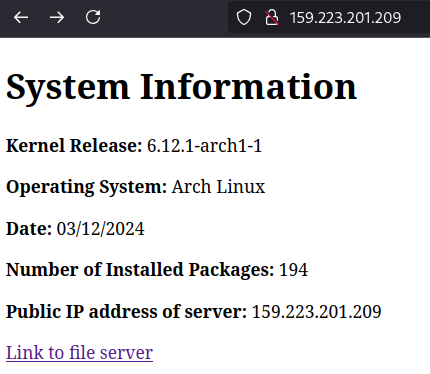
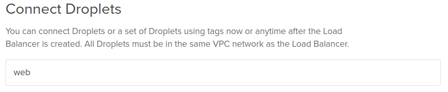

# 2420-Assignment-3-2

# Setting up a load balancer on DigitalOcean

# Table of contents
- [Create the Nginx web servers](#create-the-nginx-web-servers)
- [Create the load balancer](#create-the-load-balancer)

# Create the Nginx web servers

>[!NOTE]
> When making your droplets, give them identical tags. This will be used later on when we create the load balancer.

Set up two identical Nginx web server droplets on your DigitalOcean account using the files and script in this repository. Follow the steps below:

1. First thing you need to do is ensure your droplets Arch Linux system is up-to-date:
```
sudo pacman -Syu
```

2. Make sure to reboot the droplet as well:
```
sudo reboot
```
>[!NOTE]
> This will kick you out of your server. It will take a minute or so until you can SSH back in.

3. SSH back into your droplet and clone this repository into your home directory:
```
git clone https://github.com/thongish/2420-Assignment-3-2.git ~/nginx-setup
```

4. cd into the cloned directory:
```
cd ~/nginx-setup
```

5. Run the script with this command:
```
sudo ./setup-script
```

Check that everything worked by entering your both your droplet's IP addresses in your web browser. You should see something like this:



# Create the load balancer

To setup a load balancer on DigitalOcean:

1. On your DigitalOcean dashboard, click the green "Create" button near the top right of your screen.

2. Choose "Load Balancers" in the drop down menu.

Most of the settings will be default. The only things we need to change are the datacenter region and the tag to use when connecting droplets.

3. Choose the datacenter region that your two web server droplets belong to.

4. Enter the tag you specified earlier when creating your web server droplets.



5. Optionally, you can name your load balancer.

Once the load balancer is finished initializing, you will be able to enter its IP address into your browser and it will redirect you to either one of your web servers.Refresh the page to see the IP addresses change.

# CONGRATS
